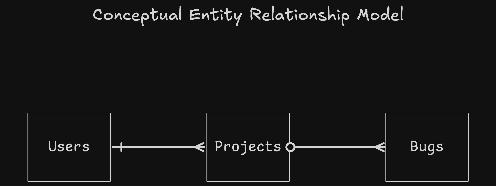
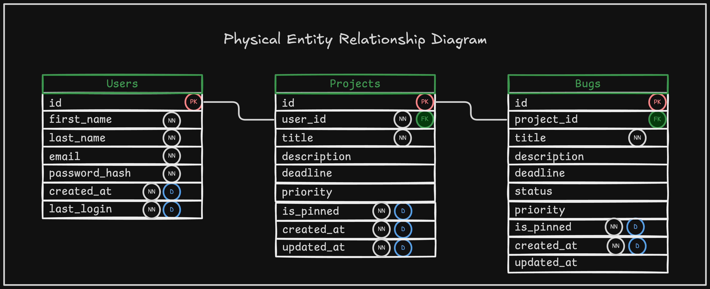

# Schema Planning

## Entity Relationship Diagrams

### Conceptual ERD



### Physical ERD



---

## Tables

### Users Table

| Column | Type | Constraints | Description |
|--------|------|-------------|-------------|
| id | SERIAL | PRIMARY KEY | Unique identifier for user |
| first_name | VARCHAR(50) | NOT NULL | User's first name |
| last_name | VARCHAR(50) | NOT NULL | User's last name |
| email | VARCHAR(255) | NOT NULL, UNIQUE | User's email address |
| password_hash | VARCHAR(255) | NOT NULL | Hashed password for authentication |
| created_at | TIMESTAMP | NOT NULL, DEFAULT CURRENT_TIMESTAMP | Account creation timestamp |
| last_login | TIMESTAMP | NOT NULL, DEFAULT CURRENT_TIMESTAMP | Last login timestamp |

### Projects Table

| Column | Type | Constraints | Description |
|--------|------|-------------|-------------|
| id | SERIAL | PRIMARY KEY | Unique identifier for project |
| user_id | INTEGER | NOT NULL, FOREIGN KEY → users(id) ON DELETE CASCADE | Project owner reference |
| title | VARCHAR(255) | NOT NULL | Project name/title |
| description | TEXT | | Detailed project description |
| deadline | DATE | | Project deadline (optional) |
| priority | VARCHAR(50) | CHECK (priority IN ('low', 'medium', 'high', 'critical')) | Project priority level |
| is_pinned | BOOLEAN | NOT NULL, DEFAULT FALSE | Whether project is pinned to top |
| created_at | TIMESTAMP | NOT NULL, DEFAULT CURRENT_TIMESTAMP | Project creation timestamp |
| updated_at | TIMESTAMP | NOT NULL, DEFAULT CURRENT_TIMESTAMP | Last update timestamp |

### Bugs Table

| Column | Type | Constraints | Description |
|--------|------|-------------|-------------|
| id | SERIAL | PRIMARY KEY | Unique identifier for bug |
| project_id | INTEGER | NOT NULL, FOREIGN KEY → projects(id) ON DELETE CASCADE | Parent project reference |
| title | VARCHAR(255) | NOT NULL | Bug title/summary |
| description | TEXT | | Detailed bug description |
| deadline | DATE | | Bug resolution deadline (optional) |
| status | VARCHAR(50) | NOT NULL, DEFAULT 'open', CHECK (status IN ('open', 'in_progress', 'resolved', 'closed', 'wont_fix')) | Current bug status |
| priority | VARCHAR(50) | CHECK (priority IN ('low', 'medium', 'high', 'critical')) | Bug priority level |
| is_pinned | BOOLEAN | NOT NULL, DEFAULT FALSE | Whether bug is pinned to top |
| created_at | TIMESTAMP | NOT NULL, DEFAULT CURRENT_TIMESTAMP | Bug creation timestamp |
| updated_at | TIMESTAMP | NOT NULL, DEFAULT CURRENT_TIMESTAMP | Last update timestamp |

### Relationships

- **Users → Projects**: One-to-Many
  - **ON DELETE CASCADE**: Deleting a user deletes all their projects
  - Foreign Key: `projects.user_id` references `users.id`

- **Projects → Bugs**: One-to-Many
  - Foreign Key: `bugs.project_id` references `projects.id`
  - **ON DELETE CASCADE**: Deleting a project deletes all its bugs

### Indexes
```sql
CREATE INDEX idx_projects_user_id ON projects(user_id);
CREATE INDEX idx_projects_is_pinned ON projects(is_pinned);
CREATE INDEX idx_bugs_project_id ON bugs(project_id);
CREATE INDEX idx_bugs_status ON bugs(status);
CREATE INDEX idx_bugs_priority ON bugs(priority);
CREATE INDEX idx_bugs_is_pinned ON bugs(is_pinned);

-- Unique constraint for email:
CREATE UNIQUE INDEX idx_users_email ON users(email);
```

---

## Data Validation:

### Valid Bug `status` Values

- `open` - Bug is newly reported (default)
- `in_progress` - Bug is currently being worked on
- `resolved` - Bug has been fixed
- `closed` - Bug is verified and closed
- `wont_fix` - Bug will not be addressed

### Valid Project & Bug `priority` Values

- `low`
- `medium`
- `high`
- `critical`

### All `VARCHAR` Properties

- Inputs **must** contain at least 1 non-whitespace character
- Leading and trailing whitespaces removed before submission
- 2 or more consecutive whitespaces within an input (not including trailing and leading whitespace) will be reduced to a single whitespace before submission

---

## Default Project For ALL Users:

A default project is created for **all** users, "Misc". This project is meant to house bugs that have no project they've been assigned to.

### Business Rules:

- Upon creation of a User entity, a Project entity, titled "Misc", is created for that User
- Bugs with no `project_id` given will by default be placed in the "Misc" Project (logic for this is done in app, not through column constraints)
- "Misc" **cannot** be deleted by a User
- Properties of "Misc" **cannot** be edited by a User (with the exception of `is_pinned`)
- "Misc" is pinned by default (`is_pinned = true`)